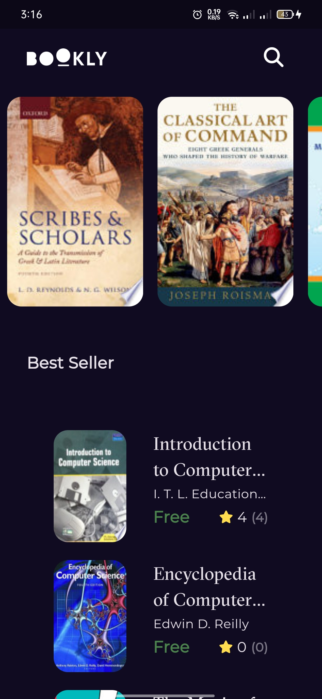
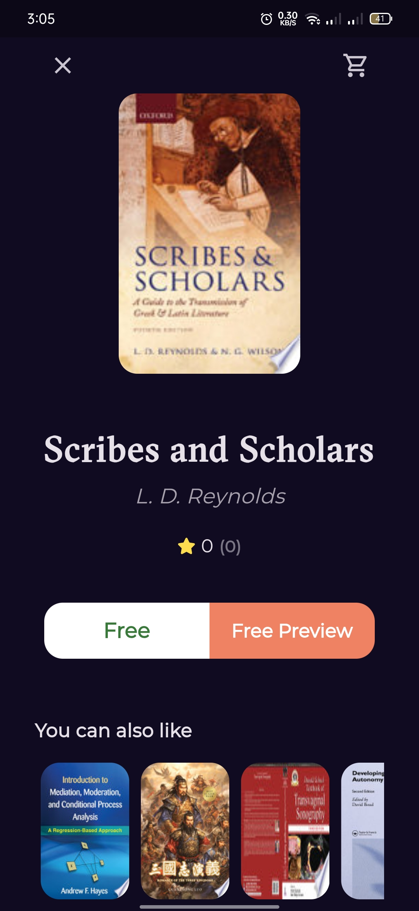
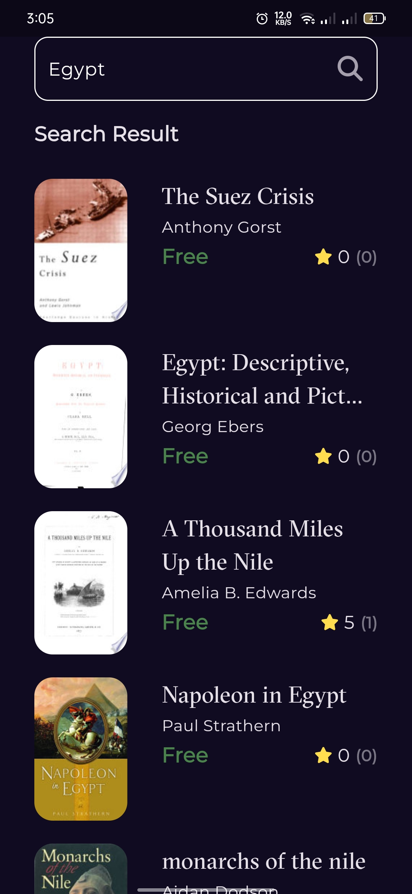

# 📚 Book Explorer App

  

A beautifully designed **Book App** that allows users to:
- 📖 Explore a diverse collection of books  
- 📚 View detailed book information  
- 🔍 Search and organize their favorite titles

Delivering a smooth and enriching reading experience.

---

## 📸 App Screenshots

### 🏠 Home Book View

### 📘 Book Details

### 🔎 Search for Book

---

## 🚀 Tech Stack
- Flutter
- RESTful APIs for Books
- State Management: Bloc /cubit

---

## 📬 Contact
For feedback or inquiries, feel free to get in touch!
